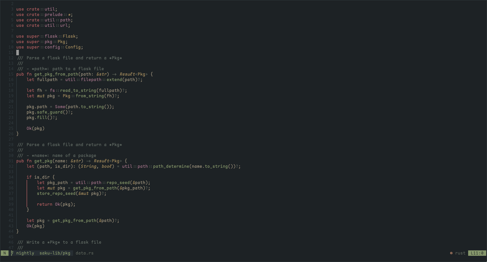
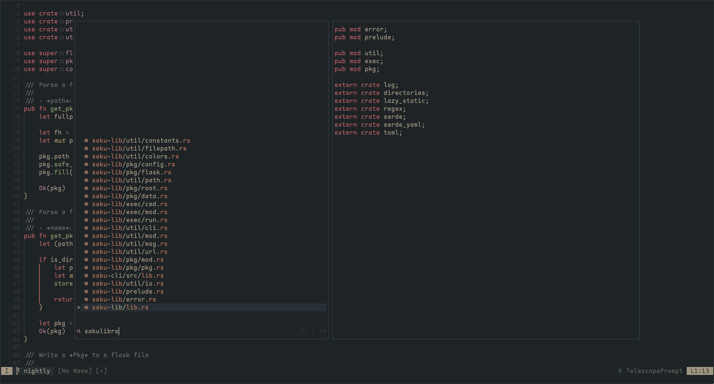

evergarden is a comfy neovim colorscheme for cozy morning coding.

evergarden is inspired by the [everforest colorscheme](https://github.com/sainnhe/everforest).

evergarden was designed as a cozy theme with a focus on readability and visual comfort.

## Installation

using [lazy.nvim](https://github.com/folke/lazy.nvim):

```lua
return {
  'comfysage/evergarden',
  priority = 1000, -- Colorscheme plugin is loaded first before any other plugins
  opts = {
    transparent_background = true,
    contrast_dark = 'medium', -- 'hard'|'medium'|'soft'
    overrides = { }, -- add custom overrides
  }
}
```

using [vim-plug](https://github.com/junegunn/vim-plug):

```Vim
Plug 'comfysage/evergarden'
```

## Configuration

```lua
require 'evergarden'.setup {
  transparent_background = false,
  contrast_dark = 'medium', -- 'hard'|'medium'|'soft'
  override_terminal = true,
  style = {
    tabline = { reverse = true, color = 'green' },
    search = { reverse = false, inc_reverse = true },
    types = { italic = true },
    keyword = { italic = true },
    comment = { italic = false },
  },
  overrides = { }, -- add custom overrides
}
```

### Overrides

Overrides can take all options passed to `vim.api.nvim_set_hl()`.

> [!note]
>
> - Ensure that `fg` (foreground color) and `bg` (background color) are correctly positioned as the first and second elements in the table, respectively. The `fg` and `bg` fields can also be refered to directly.
> - Confirm that `fg` and `bg` are strings or arrays, with the first element representing the GUI color, and the second element representing the CTERM (Color Terminal) color, if specified.

```lua
require 'evergarden'.setup {
  overrides = {
    Normal = {
      { '#fddce3', 8 }, -- GUI color and cterm color for 'fg'
      { '#1d2021' },    -- GUI color for 'bg'

      -- Additional highlight options can be included here

      bold = true,
      italic = false,
    },
    Keyword = {
      fg = '#ce96de',         -- GUI color for 'fg'
      bg = { '#ae45be', 5 },  -- GUI color and cterm color for 'bg'
    },
  },
}
```

## Features

- Lots of style-customization options (contrast, color invertion etc.)
- Support for Treesitter highlighting.
- Support for transparent background.
- Supported plugins: [GitGutter][], [Telescope][].

  [gitgutter]: https://github.com/airblade/vim-gitgutter
  [telescope]: https://github.com/nvim-telescope/telescope



## :sparkles: Extras

- [kitty theme](./extras/kitty)
- [base16-scheme](./extras/base16)

## License

[MIT/X11](https://en.wikipedia.org/wiki/MIT_License)
